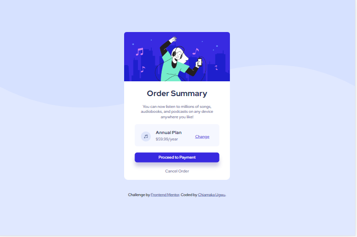

# Frontend Mentor - Order summary card solution

This is a solution to the [Order summary card challenge on Frontend Mentor](https://www.frontendmentor.io/challenges/order-summary-component-QlPmajDUj). Frontend Mentor challenges help you improve your coding skills by building realistic projects. 

## Table of contents

- [Overview](#overview)
  - [Screenshot](#screenshot)
  - [Links](#links)
- [My process](#my-process)
  - [Built with](#built-with)
  - [What I learned](#what-i-learned)
- [Author](#author)

## Overview

### Screenshot

### Links

- Live Site URL: [https://chiamaka-ugwu.github.io/Order-Summary/](https://chiamaka-ugwu.github.io/Order-Summary/)

## My process

### Built with

- Semantic HTML5 markup
- CSS custom properties

### What I learned
I am trying to get comfortable with using the "rem" standard of measurement in place of pixels. I'm still very much used to pixels but I hope to improve on others, for accessibility sake.

### Useful resources

- [PX to REM Concerter](http://www.standardista.com/px-to-rem-conversion) - This helped me to convert values in pixels to rem.

## Author

- Frontend Mentor - [@chiamaka-ugwu](https://www.frontendmentor.io/profile/chiamaka-ugwu)
- Twitter - [@chiamakaugwu_](https://www.twitter.com/chiamakaugwu_)
